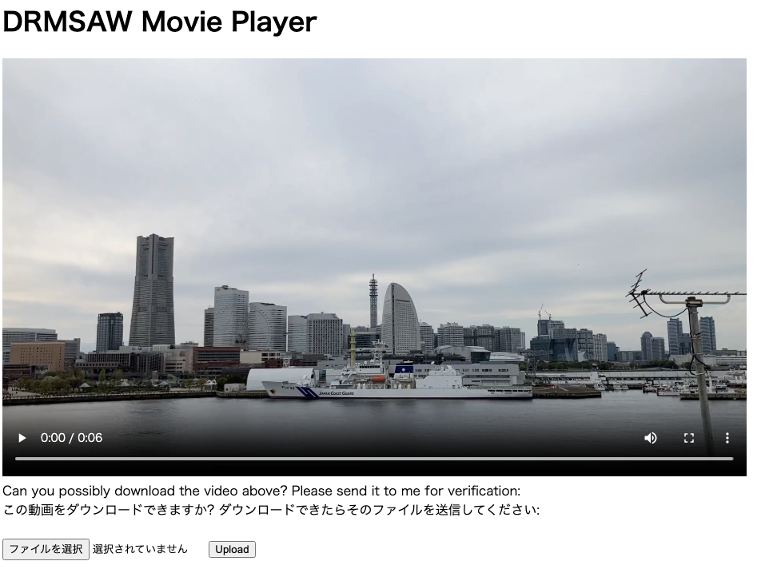
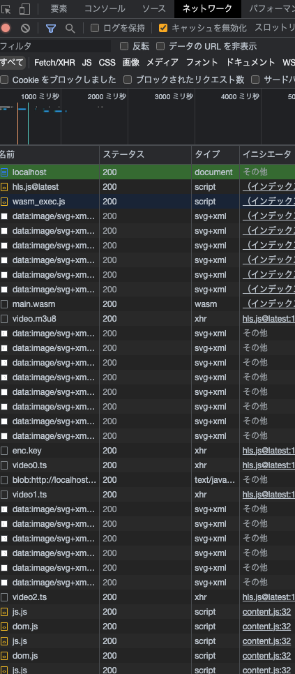
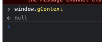
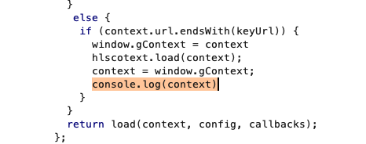
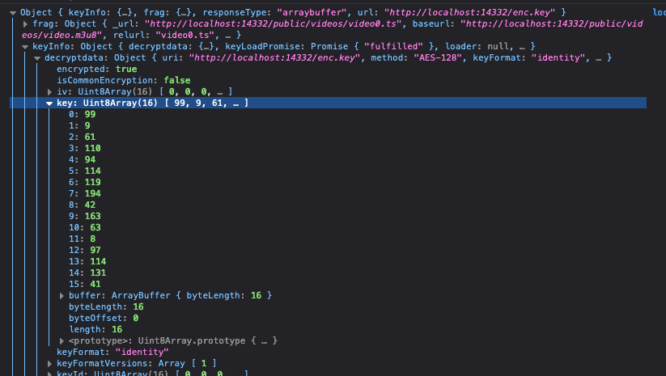

# drmsaw

DRMSAW Movie Playerは著作権を重視したセキュアな動画再生プラットフォームです。もしあなたが動画をダウンロードできたら、フラグと交換しましょう。

この動画をダウンロードできますか? ダウンロードできたらそのファイルを送信してください:



このページにアクセスすると、動画関係のファイルとして以下のファイルをダウンロードします。

- main.wasm
- hls.js@latest
- video.m3u8
- video0.ts
- video1.ts
- video2.ts
- enc.key



これは、hls.jsを用いて、動画をいくつかのセグメント(*.ts)に分解し、それぞれを暗号化して送信していることがわかります。後述しますが、**本来は**video.m3u8にプレイリストが記載されており、ここに鍵または鍵のURLが記載されています。しかし、ここには`URI="video://hello_where_is_my_key?"`というダミーのURLしか書かれていません。また、enc.keyに鍵が、入っていそうですが、実際にはダミーの鍵しか入っていません。

本問は2つのフェーズで構成されています。

1. 暗号化鍵を入手する
2. 動画のセグメントをダウンロードし、復元する

## 1. 暗号化鍵を入手する

まずはどのようにして暗号化が行われているか調べます。index.html内のスクリプトは以下のようになります。

```js
const keyUrl = "/enc.key";
class CustomLoader extends Hls.DefaultConfig.loader {
    constructor(config) {
        super(config);
        this.context = { url: keyUrl };
        const load = this.load.bind(this);
        this.load = function (context, config, callbacks) {
            if (context.type === "manifest") {
                const onSuccess = callbacks.onSuccess;
                callbacks.onSuccess = function (response, stats, context) {
                    response.data = response.data.replace(
                        /#EXT-X-KEY:METHOD=.*,URI=".*"/,
                        `#EXT-X-KEY:METHOD=AES-128,URI="${keyUrl}"`
                    );
                    onSuccess(response, stats, context);
                };
            } else {
                if (context.url.endsWith(keyUrl)) {
                    window.gContext = context
                    hlscotext.load(context);
                    context = window.gContext;
                }
                window.globalContext = null;
            }
            return load(context, config, callbacks);
        };
    }
}

function mediaPlayer() {
    const video = document.getElementById("video");
    if (!video) {
        return;
    }
    if (typeof Hls !== "undefined" && Hls.isSupported()) {
        const hls = new Hls({ loader: CustomLoader });
        const streamUrl = "/public/videos/video.m3u8";
        hls.loadSource(streamUrl);
        hls.on(Hls.Events.MANIFEST_PARSED, () => {
            hls.attachMedia(video);
            video.addEventListener("canplay", () => {
                console.info("The video can play!");
            });
        });
    } else {
        alert("sorry, your browser does not support.");
    }
}

const initWasm = async () => {
    console.log("wasm loading: start!");
    try {
        const go = new Go();
        const response = await fetch("/main.wasm");
        const buffer = await response.arrayBuffer();
        const result = await WebAssembly.instantiate(buffer, go.importObject);
        go.run(result.instance);
        console.log("wasm loading: finished!");
    } catch (e) {
        alert("sorry, your browser does not support wasm.");
    }
};
initWasm().then(() => {
    mediaPlayer();
});
```

これを見ると、以下の処理を行っていることがわかります。

1. wasmをロードする
2. `mediaPlayer()`関数を実行する
3. m3u8ファイルを読み込み、パースが終わったタイミングで動画を再生する
   1. hlsのloaderに`CustomLoader`を設定している。これはロード時に任意のスクリプトを実行したりすることができる。
   2. `CustomLoader`は、`manifest`ファイルをロードしたときに、URIの部分を書き換えている。これにより、実際にはダミーの鍵しか入っていないenc.keyを参照するようになる(が、そのenc.keyの中身もダミーである)。
   3. `context.type !== "manifest"`の時かつ`context.url.endsWith(keyUrl)==true`の時は`hlscotext.load(context)`というどこにも定義されていない謎の関数が呼ばれている(実際、これはwasm内で定義されている)。

また、プログラムのどこかで鍵の中身が書き換わっているはずです。ではければ鍵ファイルの中身がダミーなのに、動画が再生できるはずがありません。

ここで、以下の処理の内容を推測してみましょう。`context`が`keyUrl`で終わる時、つまり鍵ファイルを読み込んでいるときに、`hlscotext.load(context)`が呼ばれています。つまり、wasmの中で`window.gContext`の中身を読み取り、鍵を書き換え、`context`に代入しています。

```js
if (context.url.endsWith(keyUrl)) {
    window.gContext = context
    hlscotext.load(context);
    context = window.gContext;
}
```

`window.gContext`の中身を表示しても、nullが返ってきます。つまり、wasmの中で`context = window.gContext`が終わったあとのどこかのタイミングでsetTimeoutなどを使用して`window.gContext`の中身を書き換えていると考えられます。



そこで、`context = window.gContext`が行われた直後にcontextを表示するスクリプトを、Burpなどを用いて挿入します(Burp内のブラウザはwasmが対応していないので、ChromeやFirefoxなどにプロキシを設定して使用してください)。



すると、keyInfoのdecryptdataのkeyに鍵が入っています。



これで、鍵が入手できました。

```txt
key = [99, 9, 61, 110, 94, 114, 119, 194, 42, 163, 63, 8, 97, 114, 131, 41]
```

## 2. 動画のセグメントをダウンロードし、復元する

### 2-1. 動画のセグメントをダウンロードする

ブラウザのネットワークタブからvideo0.ts, video1.ts, video3.tsがダウンロードされていることがわかりました。

```sh
wget https://drmsaw.beginners.seccon.games/public/videos/video0.ts
wget https://drmsaw.beginners.seccon.games/public/videos/video1.ts
wget https://drmsaw.beginners.seccon.games/public/videos/video2.ts
```

### 2-2. 動画のセグメントを復元する

復元に必要なファイルは残り二つ、m3u8ファイルと鍵ファイルです。m3u8ファイルはダウンロードされたファイルを少し変更します。鍵ファイルとセグメントファイルのURIをfileスキーマに書き換えます。

```txt
#EXTM3U
#EXT-X-VERSION:3
#EXT-X-TARGETDURATION:3
#EXT-X-MEDIA-SEQUENCE:0
#EXT-X-KEY:METHOD=AES-128,URI="file:///app/enc.key",IV=0x00000000000000000000000000000000
#EXTINF:3.040000,
file:///app/video0.ts
#EXTINF:3.040000,
file:///app/video1.ts
#EXTINF:2.280000,
file:///app/video2.ts
#EXT-X-ENDLIST
```

また、鍵ファイルは先ほど入手した鍵をバイト列に変換して書き込みます。

```py
def make_key():
    key = [99, 9, 61, 110, 94, 114, 119, 194, 42, 163, 63, 8, 97, 114, 131, 41]
    with open("enc.key", "wb") as f:
        f.write(bytes(key))
```

最後に、これらのファイルに対してffmpegを使用して復元します。

```sh
ffmpeg -allowed_extensions ALL -i ./video.m3u8 -c copy video.mp4 -y
```

これで動画ファイルが復元できました。最後に、Webサイトに送信すればフラグが得られます。

これまでの処理をまとめると、以下のスクリプトになります。

```py
import subprocess
import requests

APP_URL = "http://drmsaw.beginners.seccon.games"

def download():
    subprocess.run(["wget", f"{APP_URL}/public/videos/video0.ts"])
    subprocess.run(["wget", f"{APP_URL}/public/videos/video1.ts"])
    subprocess.run(["wget", f"{APP_URL}/public/videos/video2.ts"])

def make_key():
    key = [99, 9, 61, 110, 94, 114, 119, 194, 42, 163, 63, 8, 97, 114, 131, 41]
    with open("enc.key", "wb") as f:
        f.write(bytes(key))

def make_m3u8():
    m3u8 = """#EXTM3U
#EXT-X-VERSION:3
#EXT-X-TARGETDURATION:3
#EXT-X-MEDIA-SEQUENCE:0
#EXT-X-KEY:METHOD=AES-128,URI="file:///app/enc.key",IV=0x00000000000000000000000000000000
#EXTINF:3.040000,
file:///app/video0.ts
#EXTINF:3.040000,
file:///app/video1.ts
#EXTINF:2.280000,
file:///app/video2.ts
#EXT-X-ENDLIST
"""

    with open("video.m3u8", "w") as f:
        f.write(m3u8)

def combine():
    subprocess.run(["ffmpeg", "-allowed_extensions", "ALL", "-i", "./video.m3u8", "-c", "copy", "video.mp4", "-y"])

def upload():
    mimetype = "video/mp4"
    file = {'video': ('file', open('./video.mp4', 'rb'), mimetype)}
    res = requests.post(f"{APP_URL}/flag", files=file).text
    print(res)

if __name__ == "__main__":
    download()
    make_key()
    make_m3u8()
    combine()
    upload()
```

これを実行すると、フラグが得られます。

```txt
(｡˃ ᵕ ˂ ) Congratulation! ctf4b{d1ff1cul7_70_3n5ur3_53cur17y_1n_cl13n7-51d3-4pp5}
```
